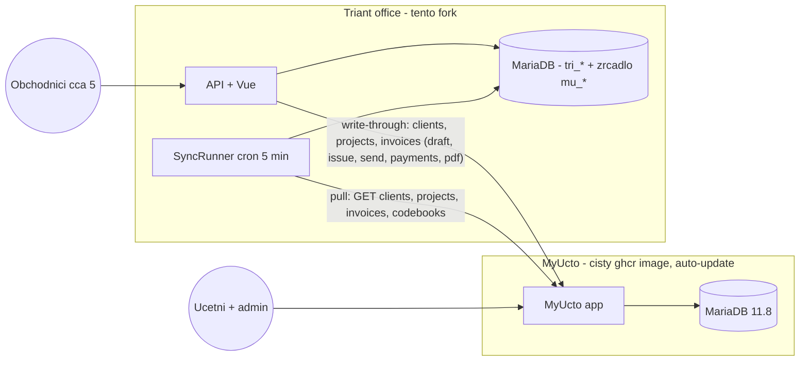

# 18 — Architektura: MyÚčto (účetní backend) + Triant office (nadstavba) přes API

Stav: **schváleno 2026-09-07**. Tento dokument je zdroj pravdy pro rozdělení systému
a pro implementační fáze (briefy ve [`source/19-myucto-phase-briefs.md`](19-myucto-phase-briefs.md),
runbook nasazení ve [`source/20-office-deploy-runbook.md`](20-office-deploy-runbook.md)).

## 1. Rozhodnutí

- Nasazuje se **čisté MyÚčto** (`ghcr.io/radekhulan/myucto`) s automatickými updaty —
  kvůli legislativě (DPH, EPO) a licenci se jeho kód **nikdy neupravuje**.
- Tento fork se stává **Triant office**: samostatná aplikace pro zakázky, nabídky,
  ceníky, průvodky, kalendář, reklamace + **kompletní fakturační front-end**.
  Upstream merge **končí** (poslední: v4.56.4, 2026-09-07) — viz `TRI-upstream-merge.md`.
- **Obchodníci (cca 5 uživatelů) pracují výhradně v Triant office** a účet v MyÚčtu
  nemají. Do MyÚčta chodí jen účetní a admin (banka, párování plateb, zaúčtování,
  storna/dobropisy, DPH, uzávěrky). Licence MyÚčta se platí za aktivního uživatele —
  obchodníci ji nezvyšují.
- Komunikace výhradně přes **MyÚčto REST API v1** (PAT token). Fakturace, klienti
  a projekty jsou v MIT části MyÚčta → integrace nezávisí na aktivní licenci.
- Domény: `office.triant.cz` = Triant office (nový stack `/opt/office`),
  `ucto.triant.cz` = MyÚčto (nový stack `/opt/myucto`). `dev.office.triant.cz`
  (stack `/opt/myinvoice-triant`) se opouští. **Čistý start bez převodu dat.**

## 2. Cílová architektura

### Principy (neporušovat)

1. **MyÚčto = system of record** pro kontakty, faktury a projekty. Triant DB drží
   jen zrcadlo (`mu_*` tabulky + `clients`) a vlastní doménu (`tri_*`).
2. **Write-through**: UI Triantu nikdy nezapisuje do zrcadla přímo. Každý zápis jde
   přes API do MyÚčta a zrcadlo se aktualizuje z odpovědi. Žádné dvousměrné
   slučování konfliktů neexistuje.
3. **Triant je fakturační front-end**: obchodník v Triantu založí koncept (ze
   zakázky nebo volně), upraví položky, vystaví, odešle e-mailem, pošle upomínku,
   stáhne PDF. MyÚčto drží pravdu (číslování, PDF snapshot, zákonné validace,
   e-mail přes jeho SMTP a šablony).
4. **Seznamy ze zrcadla, detail/editor přímo z API**: přehledy čtou `mu_invoices`;
   otevření detailu/editoru vždy zavolá `GET /invoices/{id}` a odpověď upsertne
   do zrcadla.
5. **Vazba faktura↔zakázka žije v MyÚčtu**: Triant zakázka má
   `tri_jobs.myucto_project_id`; faktury nesou `project_id`
   (+ `supplier_order_number` = číslo zakázky). `tri_job_invoices` se ruší.
6. **Oprávnění vynucuje Triant** (servisní token má plná práva): role
   `admin`/`accountant`/`readonly` z existujícího auth. Storno, dobropis a mazání
   vystavených dokladů se z Triantu nedělá vůbec (jen v MyÚčtu).
7. **Každá mutace faktury jde výhradně přes `InvoiceGateway`** — žádná akce nevolá
   `MyUctoClient` přímo.

## 3. MyÚčto REST API v1 — ověřený kontrakt

Zdroj: `api/openapi.yaml` a `manual/99_API.md` v repu [radekhulan/myucto](https://github.com/radekhulan/myucto).

- **Auth**: `Authorization: Bearer mi_pat_…` (Personal Access Token). Scope `read`
  nebo `read_write`; token vázaný na firmu (supplier); volitelný IP allowlist
  (IPv4/IPv6 vč. CIDR). Bez expirace, revokace instantní.
- **Rate limit**: 600 req/min/token; `429` + `Retry-After`; hlavičky
  `X-RateLimit-Limit/Remaining/Reset`.
- **Verzování**: stabilní `/api/v1/...`, každá odpověď `X-API-Version: 1`.
- **Chyby**: jednotný envelope `{ "error": { "code": "...", "message": "..." } }`.
  Kódy: `unauthenticated`, `invalid_token`, `insufficient_scope`,
  `token_endpoint_forbidden`, `token_write_forbidden`, `session_required`,
  `token_ip_forbidden`, `validation_failed`, `not_found`, `rate_limited`.
- **Není**: webhooky (jen polling), `Idempotency-Key`, filtr `updated_since`, OAuth/SSO.
- **Ověřeno v openapi**: žádný endpoint pro `clients`/`invoices`/`projects` není
  session-only → celý fakturační cyklus jde přes PAT.

### Endpointy, které používáme

| Oblast | Endpointy |
|---|---|
| Klienti | `GET/POST /clients`, `GET/PUT/DELETE /clients/{id}`, `POST /clients/{id}/archive`, `/unarchive`, `POST /clients/lookup-ares` |
| Projekty (Zakázky) | `GET/POST /projects`, `GET/PUT /projects/{id}`, `POST /projects/{id}/archive`, `GET /clients/{client_id}/projects` |
| Faktury — draft | `POST /invoices`, `PUT/DELETE /invoices/{id}`, `GET /invoices/preview-varsymbol` |
| Faktury — cyklus | `POST /invoices/{id}/issue`, `GET /invoices/{id}/recipients`, `POST /invoices/{id}/send`, `POST /invoices/{id}/reminder`, `POST /invoices/{id}/public-link`, `POST /invoices/{id}/clone` |
| Platby | `POST /invoices/{id}/mark-paid`, `GET/POST /invoices/{id}/payments`, `DELETE /invoices/{id}/payments/{paymentId}`, `POST /invoices/{id}/unmark-paid` |
| Zálohy | `GET /invoices/{id}/advance-candidates`, `POST/DELETE /invoices/{id}/link-advance`, `POST /invoices/{id}/issue-final` |
| Čtení | `GET /invoices` (filtry `filter[status|type|client_id|project_id|year|month|date_from|date_to]`, `q`, `page`, `per_page` ≤ 200), `GET /invoices/{id}`, `GET /invoices/{id}/pdf`, `GET /invoices/{id}/activity` |
| Číselníky | `GET /codebooks/{countries,currencies,vat-rates,units,years}`, `GET /settings/vat-rates`, `GET /settings/currencies`, `GET /branding-profiles` |
| Systém | `GET /health`, `GET /version`, `GET /auth/api-me` |

### Klíčové vstupní schéma

- `ClientInput` (required: `company_name`, `street`, `city`, `zip`): + `first_name`,
  `last_name`, `ic`, `dic`, `country_iso2` (pozor: vstup je ISO2, ne `country_id`),
  `main_email`, `phone`, `is_customer`, `is_vendor`, `payment_due_default`,
  `email_contacts` (replace-all pole, max 10), …
- `InvoiceInput` (required: `client_id`, `items`): `project_id`,
  `branding_profile_id`, `invoice_type` ∈ `invoice|proforma|credit_note|payment_calendar`
  (jen tato čtveřice; `cancellation`/`tax_document` vznikají vlastními cestami),
  `issue_date`, `due_date`, `tax_date`, `currency`, `advance_paid_amount`,
  `supplier_order_number`, `note_above_items`, `note_below_items`, `items[]`.
- `InvoiceItemInput` (required: `description`, `quantity`, `unit_price_without_vat`,
  `vat_rate_id`): + `unit`, `order_index`.
- `ProjectInput` (required: `client_id`, `name`, `payment_due_days`): +
  `project_number`, `status` ∈ `active|paused|closed`, `note`.
- `Invoice` (výstup): `status` ∈ `draft|issued|sent|reminded|paid|cancelled`,
  `payment_status` ∈ `unpaid|partially_paid|paid|overpaid|null`, `varsymbol`,
  `totals`, `vat_breakdown`, `amount_to_pay`, `paid_total`, `public_token`,
  `sent_at`, `reminder_count`, `updated_at`, `items[]`.

## 4. Datový model v Triant DB (migrace `9017+`)

- **`clients` zůstává** jako zrcadlo kontaktů (zachovává 4 TRI FK:
  `tri_jobs.customer_client_id`, `tri_job_contacts.client_id`,
  `tri_client_tags.client_id`, `tri_quote_variants.customer_client_id`). Přidat:
  `myucto_id BIGINT UNSIGNED NULL UNIQUE`, `myucto_updated_at DATETIME NULL`,
  `mu_synced_at DATETIME NULL`. Lokální `id` je čistě interní — do API se posílá
  **vždy `myucto_id`**.
- **`mu_invoices`** — štíhlé zrcadlo, PK = MyÚčto `id` (BIGINT UNSIGNED, žádné
  AUTO_INCREMENT): `client_myucto_id`, `project_id`, `varsymbol`, `invoice_type`,
  `status`, `payment_status`, `issue_date`, `due_date`, `tax_date`, `currency`,
  `total_without_vat`, `total_vat`, `total_with_vat`, `amount_to_pay`,
  `paid_total`, `paid_at`, `supplier_order_number`, `sent_at`, `reminder_count`,
  `last_reminder_at`, `public_token`, `client_main_email`, `branding_profile_id`,
  `items_json` (položky z posledního GET detailu), `raw_json`, `updated_at`
  (z MyÚčta), `mu_synced_at`, `deleted_at`. Bez FK na core tabulky.
- **`mu_projects`** — PK = MyÚčto `id`: `client_myucto_id`, `name`,
  `project_number`, `status`, `updated_at`, `raw_json`, `mu_synced_at`.
- **`tri_jobs`** += `myucto_project_id BIGINT UNSIGNED NULL UNIQUE`.
- **`mu_vat_rates`, `mu_currencies`, `mu_units`, `mu_branding_profiles`** —
  zrcadla číselníků (editor faktur nabízí jen platná `vat_rate_id`, měny,
  jednotky, profily).
- **`mu_sync_state`**(`key` PK, `last_run_at`, `last_ok_at`, `cursor`,
  `last_error`) a **`mu_sync_log`**(`id`, `kind`, `direction`, `myucto_id`,
  `http_status`, `message`, `created_at`).
- **`mu_commands`**(`id`, `kind`, `payload_json`, `status`
  ∈ `pending|done|unknown|failed`, `myucto_id`, `error`, `created_at`) — ochrana
  proti duplicitám při timeoutu (MyÚčto nemá Idempotency-Key).
- **`tri_job_invoices` se dropne** po přechodu na `project_id`. Ponechá se jen
  `tri_job_invoice_overrides(invoice_id, job_id)` jako výjimka pro faktury,
  kterým už nejde změnit projekt (jen drafty mají `PUT`).

## 5. Backend (`api/src/Tri/MyUcto/`)

### 5.1 `MyUctoClient` (Guzzle)

Konfigurace z env: `TRI_MYUCTO_BASE_URL` (interní, `http://myucto-app`),
`TRI_MYUCTO_PUBLIC_URL` (`https://ucto.triant.cz`, jen pro deep linky),
`TRI_MYUCTO_TOKEN`, `TRI_MYUCTO_ENABLED`.

- Řeší `429` + `Retry-After` (retry s backoffem), sleduje `X-RateLimit-Remaining`,
  mapuje error envelope na `MyUctoApiException(code, message, httpStatus)`.
- Metody 1:1 k endpointům výše: `listClients`, `createClient`, `updateClient`,
  `archiveClient`, `listProjects`, `createProject`, `updateProject`,
  `listInvoices`, `getInvoice`, `createInvoice`, `updateInvoice`, `deleteInvoice`,
  `previewVarsymbol`, `issueInvoice`, `getRecipients`, `sendInvoice`,
  `sendReminder`, `getInvoicePdf` (stream), `getPublicLink`, `markPaid`,
  `listPayments`, `addPayment`, `deletePayment`, `unmarkPaid`, `cloneInvoice`,
  `linkAdvance`, `codebooks`, `brandingProfiles`, `health`, `apiMe`.

### 5.2 Sync (pull zrcadla)

- `ClientSync` — full scan `GET /clients?per_page=200` (aktivní i
  `filter[archived]=true`), upsert podle `updated_at`; id chybějící v odpovědi →
  lokálně `archived_at`.
- `ProjectSync` — full scan `GET /projects`, upsert `mu_projects`; doplnění
  `tri_jobs.myucto_project_id` podle shody `project_number` = číslo zakázky
  (pro projekty založené ručně v MyÚčtu).
- `InvoiceSync` — „hot" každý běh: `filter[date_from]=today-120d` (všechny stavy,
  stránkovat) + `filter[status]=draft`; „cold" 1× denně: aktuální + předchozí
  rok. Upsert podle `updated_at`; id z hot okna, která se nevrátila →
  `deleted_at`. On-demand: `GET /invoices?filter[project_id]=X` při otevření
  detailu zakázky.
- `CodebookSync` — 1× denně + na povel (vat-rates, currencies, units,
  branding-profiles).
- `SyncRunner` — cron kontejneru (`MYINVOICE_ENABLE_CRON`) každých 5 min; CLI
  `php api/bin/tri-myucto.php sync|ping|status|contract`.

### 5.3 Gateways (write-through)

- **`ContactGateway`** — `POST/PUT /api/tri/contacts` → MyÚčto → upsert `clients`
  z odpovědi. Chyba 4xx = validace uživateli, lokálně se nezapíše nic. Core
  client write akce v `Routes.php` se přesměrují sem.
- **`ProjectGateway::ensureProjectForJob(job)`** — při potvrzení zakázky (nebo na
  tlačítko): `POST /projects {client_id: <myucto>, name: "<číslo> <název>",
  project_number: <číslo zakázky>, payment_due_days}` →
  `tri_jobs.myucto_project_id`. Stav zakázky `completed|rejected` → `PUT`
  `status=closed`.
- **`InvoiceGateway`** — jediná mutační cesta k fakturám. Slim akce
  v `api/src/Tri/Action/Invoice/` pod `/api/tri/invoices/*`; každá metoda =
  1 volání API + upsert `mu_invoices` z odpovědi + zápis do Triant activity logu
  s reálným uživatelem:
  - `createDraft(InvoiceInput)`, `updateDraft(id, …)`, `deleteDraft(id)`,
    `previewVarsymbol()`
  - `issue(id)` — 403/409 (uzamčené období, zákonná validace) mapovat na
    srozumitelnou hlášku
  - `recipients(id)`, `send(id, to, cc, bcc, note, subject)`, `reminder(id)`
  - `pdf(id)` (stream), `publicLink(id)`
  - `markPaid(id, paid_at)`, `payments(id)`, `addPayment(…)`, `unmarkPaid(id)` —
    jen `admin`/`accountant`
  - `clone(id)`; **`cancel`/dobropis v gateway nejsou** (jen v MyÚčtu)
  - Role guard: `readonly` jen čtení; `accountant`/`admin` vše výše; storno
    a mazání vystavených nikdo z Triantu.
  - Idempotence: `createDraft` přes `mu_commands` (pending → POST → done;
    timeout → `unknown` + reconciliace re-listem draftů klienta/projektu).
    `issue`/`send`/`markPaid` jsou v MyÚčtu idempotentní podle stavu (druhé
    volání vrátí stavovou chybu, kterou UI po refreshi ignoruje).
- **`JobInvoiceBuilder`** (přepis stávajícího): sestaví `InvoiceInput`
  (`client_id` = myucto id, `project_id`, `invoice_type` proforma|invoice,
  `supplier_order_number` = číslo zakázky, položky z varianty s `vat_rate_id`
  přes `mu_vat_rates`, `advance_paid_amount` z uhrazených proform projektu ze
  zrcadla; volitelně `linkAdvance`) → `InvoiceGateway::createDraft` → UI otevře
  Triant editor s vráceným id.
- **`JobInvoiceRepository`** čte `mu_invoices WHERE project_id =
  job.myucto_project_id`; `ListTriInvoicesAction` čte zrcadlo (filtry
  stav/měsíc/klient jako dnes). Volné faktury: `project_id` volitelný.

### 5.4 Úklid core hooků

- `InvoiceRepository` — odstranit `tri_columns`/`tri_job_id`/`tri_linked`
  (JOIN `tri_job_invoices`).
- `TriDemoEnricher` — odstranit zápis do `invoices`.
- `RoleMiddleware` — doplnit `/api/tri/*` do allowlistů `accountant`/`readonly`
  (dnes 403 pro ne-adminy dřív, než doběhnou TRI role checky).
- Core invoice/client write akce → 410 (fáze zúžení).

## 6. Frontend

- `pages/tri/contacts/*` — beze změny UX, volá write-through; u kontaktu odkaz
  „Otevřít v MyÚčtu" (jen role s účtem tam, default admin).
- `pages/tri/invoices/*` — stávající stránky přepojené z `invoicesApi` na nový
  `web/src/api/triInvoices.ts` (volá `/api/tri/invoices/*`):
  - `InvoiceList`: ze zrcadla; filtry jako dnes; „Obnovit z MyÚčta".
  - `InvoiceEditor`: jen `status=draft`; načte `GET /invoices/{id}` přímo;
    položky s `vat_rate_id`/měna/jednotka z `mu_*` číselníků; uložení =
    `updateDraft`; tlačítko **Vystavit** s náhledem čísla (`previewVarsymbol`);
    pole zakázka = výběr z `tri_jobs` s `myucto_project_id`; chyby validace
    z MyÚčta u polí / v toastu.
  - `InvoiceDetail`: stav, PDF (proxy), **Odeslat e-mailem** (modal s příjemci
    z `recipients`, cc/bcc, poznámka), **Upomínka**, veřejný odkaz, platby
    (zobrazit všem; mutace jen `admin`/`accountant`), „Klonovat". Bez
    storna/dobropisu — místo toho odkaz „Otevřít v MyÚčtu". Vystavené faktury
    read-only.
- `JobDetail` — panel faktur ze zrcadla; „Vytvořit zálohu" / „Vytvořit konečnou
  fakturu" → koncept v MyÚčtu → redirect do Triant `InvoiceEditor`; „Obnovit
  z MyÚčta"; badge „Zakázka v MyÚčtu: #project_number".
- Admin: stránka **MyÚčto synchronizace** (stav běhů `mu_sync_state`, poslední
  chyby `mu_sync_log`, ruční spuštění, health MyÚčta).
- `AppLayout`/sidebar: viditelné jen TRIANT moduly, Kontakty, Faktury (TRI),
  Admin; core položky pryč z `ALLOWED_MODULE_IDS`; dashboard → zakázky.
- i18n: nové klíče `tri.myucto.*` v `cs.json` i `en.json`.

## 7. Chování při výpadku MyÚčta

- Seznamy a detaily fungují ze zrcadla read-only; editor/vystavení/odeslání vrátí
  „MyÚčto nedostupné, zkuste to později" (`MyUctoApiException` s network kódem).
- Zakázky, nabídky, průvodky, kalendář, reklamace nejsou dotčeny.
- Založení faktury/kontaktu lze bezpečně zopakovat — `mu_commands` + reconciliace
  draftů zabrání duplicitě.

## 8. Rizika a mitigace

| Riziko | Mitigace |
|---|---|
| Bez webhooků je zrcadlo až ~5 min staré | on-demand refresh v detailu zakázky/faktury |
| Bez Idempotency-Key | `mu_commands` + reconciliace draftů projektu |
| `PUT /invoices/{id}` jen u draftů | přiřazení k projektu před vystavením; jinak `tri_job_invoice_overrides` |
| Servisní token má plná práva | oprávnění vynucuje Triant; token jen v `/opt/office/.env`; IP allowlist; rotace |
| Audit v MyÚčtu ukazuje autora tokenu | skutečný autor v Triant activity logu (účetní ví, kde hledat) |
| Auto-update MyÚčta změní API | v1 je stabilní (`X-API-Version`); kontraktní test `tri-myucto.php contract` po každém updatu |
| Dva klony repa na hostu | po vzniku `/opt/office/repo` se `/opt/myinvoice-triant/repo` už neupravuje |

## 9. Pravidla pro implementaci (Grok 4.6 i ostatní)

1. Aditivní změny v `api/src/Tri/**` a `web/src/**/tri/**`; core soubory jen tam,
   kde to spec výslovně říká (RoleMiddleware, Routes, AppLayout, úklid hooků).
2. Migrace `9017+`, idempotentní (`IF NOT EXISTS`, MariaDB 10.6+), výhradně přes
   `php api/bin/migrate.php`.
3. **Nikdy neposílat lokální `clients.id` do MyÚčto API** — vždy `myucto_id`.
4. Žádné zápisy do `mu_*` mimo sync a gateway vrstvy.
5. Každá mutace faktury výhradně přes `InvoiceGateway`.
6. Kód MyÚčta se nemění; jeho DB se nikdy nečte přímo.
7. Testy: PHPUnit s Guzzle `MockHandler` pro každou metodu gateway (úspěch, 4xx
   validace, 429, timeout). Kontraktní skript `tri-myucto.php contract` proti
   testovací instanci (60denní trial stačí — fakturační API je MIT část).
8. Každá fáze končí: `cd web && pnpm build`, `cd api && php vendor/bin/phpunit`,
   deploy `scripts/up.sh` + health check.
9. i18n vždy do obou locale; UI texty přes `t()`.
